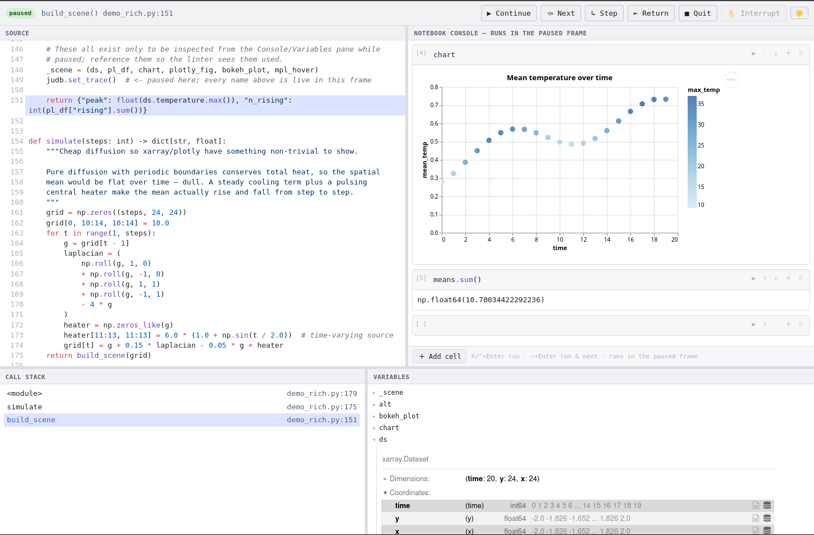

# judb

[](https://github.com/mikapfl/judb/actions/workflows/ci.yml)

A browser-based visual Python debugger for datascience - debug any Python module
or function, with the full power of jupyter notebooks.

`judb` uses `pudb`-style stepping with a
notebook-style rich console that executes cells **in the currently-paused stack
frame**. Plot and inspect a paused frame's real objects — DataFrames, arrays,
xarray Datasets, matplotlib figures — the way you would in a notebook.

<picture>
  <source media="(prefers-color-scheme: dark)" srcset="docs/images/screenshot_dark.png">
  <source media="(prefers-color-scheme: light)" srcset="docs/images/screenshot_light.png">
  
</picture>

## Status

Early prototype.

## Try it out

Requires Python ≥ 3.13.

```bash
uv add --dev judb
# Or if you use pip
pip install judb
# or, in a checkout of this repo
uv sync
```

Drop `judb.set_trace()` where you want to pause:

```python
import judb

def analyze(df):
    judb.set_trace()      # opens a browser tab, paused on the next line
    return df.describe()
```

Run your script normally. A browser tab opens at the paused frame with four
panes — **Source**, a **notebook console**, **Variables**, and the **Call
stack**. Step with the toolbar (Continue / Next / Step / Return); in the console,
type Python that runs *in the paused frame*:

```python
df                        # rich HTML table
df["x"].rolling(5).mean() # any expression, evaluated in-frame
import matplotlib.pyplot as plt; plt.plot(df["x"])   # inline figure
```

The console is a real notebook: cells are editable and re-runnable, and can be
added, deleted, and reordered. Values you keep coming back to go in the **Watch**
pane — pin an expression like `df.shape` or `arr.mean()` and it is re-evaluated
every time you stop, change frame, or run a cell. *Open file…* in the Source
pane shows any file of your project, so you can set a breakpoint in code the run
hasn't reached yet and continue straight to it.

The layout follows the window: the source keeps at least 80 columns of code
(PEP 8's line length) at any size, folding the console underneath it rather than
squeezing it, and the lower panes reflow into two or three rows on a narrow
screen. That is a floor on what the *window* does — drag the splitter narrower
yourself and it stays where you put it. Close any lower pane with the × in its
header when you want the room; **▤ Panes** in the toolbar brings it back.

You can also wire judb up as the
`breakpoint()` hook, no code change needed:

```bash
PYTHONBREAKPOINT=judb.set_trace python your_script.py
```

Or run a whole script or module under judb without touching it (stops at the
first line):

```bash
python -m judb your_script.py [args...]
python -m judb -m your.pipeline.module [args...]
```

## Debugging a failing test

Point pytest's post-mortem debugger at judb, and a failing test drops you into
the browser UI **paused at the failure**, with the console live in that frame:

```bash
pytest --pdb --pdbcls=judb:Debugger
```

Inspect the assertion's operands, plot the offending array, poke at locals — all
in the frame where the test blew up. Hit Continue to move on.

With `--pdbcls=judb:Debugger` set, pytest's other entry points reach judb too —
`--trace` breaks at the first line of every test, and a `breakpoint()` inside a
test opens the UI there:

```bash
pytest --trace --pdbcls=judb:Debugger      # break at the start of each test
pytest --pdbcls=judb:Debugger              # honour breakpoint() in a test
```

Prefer a ready-made demo? From a checkout:

```bash
uv run python scripts/demo_p2.py     # a small paused frame with an array to plot

uv sync --extra example              # heavier viz libs (xarray/plotly/bokeh/altair/polars)
uv run python scripts/demo_rich.py   # a spread of rich objects to inspect
```

## Interactive plots (zoom & pan)

By default a plot renders as a static inline PNG. For **interactive** figures —
zoom, pan, the full matplotlib toolbar, live while paused — run this once in the
console, then plot as usual:

```python
%matplotlib judb                     # judb's interactive backend
import matplotlib.pyplot as plt
plt.plot(signal)                     # a live, zoomable/pannable canvas
```

Switch back to static images at any time with `%matplotlib inline`. Standard
IPython magics work too (`%timeit`, `%who`, `%%time`, `%matplotlib inline`, …).
To start *every* session that way, set `figure_format = "interactive"` (see
[Configuration](#configuration)).

Under the hood this is matplotlib's own WebAgg engine (the same one behind
`%matplotlib notebook`) driven over judb's connection — **no Jupyter kernel
required**. Interactivity is live whenever the debuggee is paused and freezes on
Continue, since the figure lives in the paused frame.

## Configuration

judb runs with no configuration at all. When you do want to change how it
starts, put the settings in your project's `pyproject.toml`:

```toml
[tool.judb]
open_browser = true          # open a browser tab on start (the URL is always printed)
stop_on_entry = true         # `python -m judb`: pause on the target's first line
break_on_exception = true    # `python -m judb`: land in post-mortem on an uncaught crash
figure_format = "png"        # "png" for inline images, "interactive" for live figures
```

`stop_on_entry = false` is the "start it and walk away" mode: the program runs
at full speed and judb only takes over when something goes wrong (post-mortem
on the crash) or when your code asks it to (`breakpoint()`). Note that a
breakpoint you set in the gutter needs the program to still be traced, so plan
to set them during the entry stop — or put a `breakpoint()` in the code.

The same keys — without the `[tool.judb]` header, since it is judb's own file —
go in `~/.config/judb/config.toml` (or `$XDG_CONFIG_HOME/judb/config.toml`) to
apply to every project. A project's settings win over your personal ones,
key by key, and `python -m judb`'s own flags win over both for a single run:

```bash
python -m judb --no-stop-on-entry --no-browser train.py --epochs 3
```

judb's flags go **before** the script; everything after it belongs to the
script, so `--epochs 3` above reaches `train.py`. Run `python -m judb --help`
for the full list. A setting judb does not recognise is a warning on stderr, not
an error — a stale key never stops you from debugging.

Two things live in the browser instead, because that is where they are used: the
light/dark theme (the toolbar toggle) and your watch expressions, both remembered
per browser. And `JUDB_NO_BROWSER=1` in the environment suppresses the browser
tab whatever the configuration says, for headless boxes and CI.

## Threads and processes

judb debugs **one paused frame at a time**. Where that frame lives changes what
works:

| Where `set_trace()` runs | Status |
|---|---|
| The main thread (a normal script, `python -m judb`, pytest) | Fully supported |
| A single worker thread | Supported, with two caveats below |
| Two threads pausing at the same time | **Not supported** — see below |
| A child process (`multiprocessing`, `fork`, `spawn`) | Supported — each process gets its own UI |

**A single worker thread** pauses, shows its frame, and runs console cells in it
exactly as the main thread does. Two things degrade, both because only the main
thread can receive signals:

- **Interrupt** falls back from a real `SIGINT` to Python's async-exception API,
  which lands at the next bytecode. It still stops a Python loop, but it cannot
  break out of a blocking call like `time.sleep` until that call returns.
- **Ctrl+C in the terminal will not end the program.** The `KeyboardInterrupt`
  is delivered to the main thread, while the paused worker keeps waiting; if it
  is a non-daemon thread the process will not exit. Use the UI's Quit, or kill
  the process.

**Two threads pausing concurrently** is not supported yet (real multi-thread
debugging is planned for a later phase). It does not crash, but: only the most
recent pause is visible, the other paused thread is invisible while still
blocked, and each Continue releases an arbitrary one of them. If your debuggee
is multi-threaded, set a breakpoint that only one thread can reach.

**Child processes** each start their own server on their own port and print
their own URL, so you get one browser tab per paused process. This holds for
`fork` too: a forked child does not reuse its parent's server, since the threads
running it do not survive the fork.

## License

Copyright 2026 Mika Pflüger. Licensed under the [Apache License 2.0](LICENSE)
(see also [`NOTICE`](NOTICE)).

judb's debugger architecture and design borrow heavily from
[PuDB](https://github.com/inducer/pudb) (MIT/X Consortium license). PuDB's
license and attribution notice are reproduced in
[`licenses/pudb-LICENSE.txt`](licenses/pudb-LICENSE.txt). Rich-output CSS is
partly derived from [Project Jupyter](https://jupyter.org/) (BSD-3-Clause; see
[`licenses/jupyter-LICENSE.txt`](licenses/jupyter-LICENSE.txt)). The interactive
plotting backend reuses [Matplotlib](https://matplotlib.org/)'s WebAgg engine and
serves its client JS and toolbar assets (BSD-compatible license; see
[`licenses/matplotlib-LICENSE.txt`](licenses/matplotlib-LICENSE.txt)).
